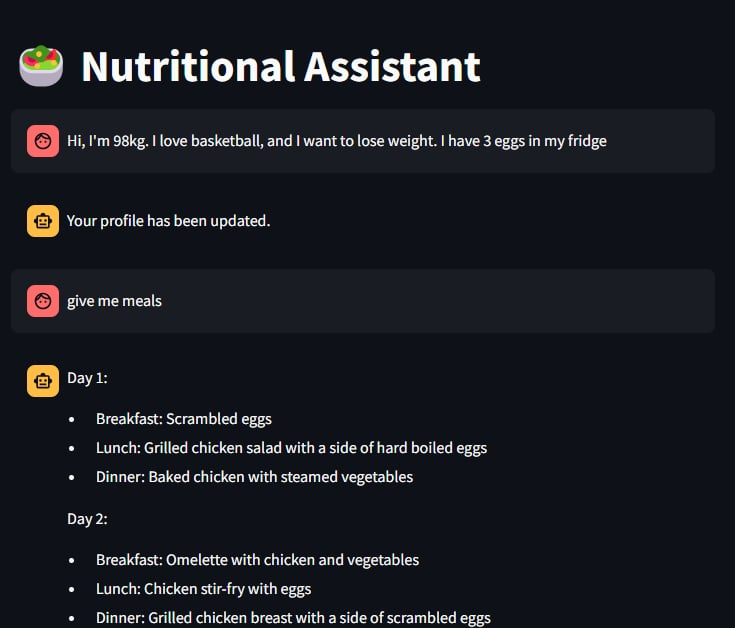
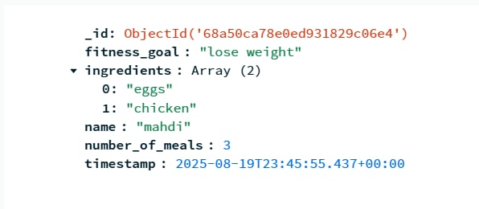

# 🥗 AI Nutritional Assistant

An AI-powered nutritional assistant built with **FastAPI**, **Streamlit**, **LangChain**, **OpenAI**, and **MongoDB**.

It provides personalized nutrition advice based on:
- Your weight, job, and physical activity
- Your previous goals (e.g., weight loss, gain)
- Stored chat history for contextualized conversations
- Embedded knowledge base (Markdown files, stored in a Chroma vector DB)

## 🚀 Features

- 🗨️ **Chat interface** (Streamlit) with conversational memory
- ⚡ **RESTful API** (FastAPI) for backend processing
- 🤖 **Personalized responses** with OpenAI LLM
- 📚 **Knowledge embeddings** stored in Chroma (created once and reused)
- 🗄️ **MongoDB integration** to store:
  - User profiles
  - Chat history
- 🔍 **Auto-detection** of missing info (weight, job, sport)
- 👥 **Multi-user support**

## 🏗️ System Architecture

```mermaid
graph TD
    A[Streamlit Frontend] --> B[FastAPI Backend];
    B --> C[OpenAI LLM];
    B --> D[MongoDB];
    B --> E[Chroma Vector DB];
    F[Knowledge Base] --> E;

## 📸 Screenshots

### 🔹 Registration & Profile Setup


### 🔹 AI Chat Interface  


### 🔹 Nutrition Goals & History



## 📦 Installation

### 1. Clone the repo
```bash
git clone https://github.com/your-username/nutritional-assistant.git
cd nutritional-assistant